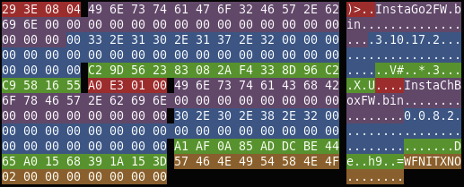
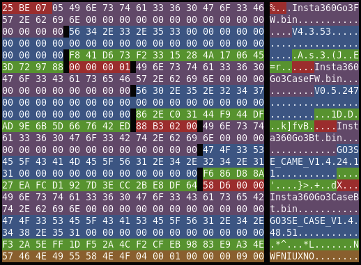

Firmware structure
==================

Insta360 GO 2 and Insta360 GO 3 have 2 hardware pieces:

* The camera itself with an Ambarella H22 SoC (Quad-Core ARM® Cortex®-A53) and a Sony IMX577-AACK image sensor. Insta360 GO 2 has an AMPAK AP5256 (with a BCM43455 inside) whereas Insta360 GO 3 has an AMPAK AP6256 (with a BCM43456 inside) for Wi-Fi and Bluetooth connectivity.
* The charge case (internally called box that is used to charge, control and storage the camera). Insta360 GO 2 case has a Realtek RTL8762CMF (ARM Cortex-M4) for Wi-Fi and Bluetooth connectivity. 

In the Insta360 GO 2 both have their own firmware, but you download only one file from [Insta360](https://www.insta360.com/download/insta360-go2).
That's why the Insta360 GO 2 firmware is different from other Insta360 cameras as it has 2 firmwares inside.
It has the usual header, camera firmware, an MD5 value for the previous data, the box firmware and a footer at the end describing both firmwares.

This is the basic structure of the Insta360 GO 2 firmware as of version 3.10.17.2:

```
0x00000000 -> 0x0000022F (size: 560 bytes, 0x230)             Header
0x00000230 -> 0x0000032F (size: 256 bytes, 0x100)             Section 0 header
0x00000330 -> 0x00BF9ACF (size: 12,556,192 bytes, 0xBF97A0)   RTOS
0x00BF9AD0 -> 0x00BF9BCF (size: 256 bytes, 0x100)             Section 1 header
0x00BF9BD0 -> 0x00FA1BCF (size: 3,833,856 bytes, 0x3A8000)    ROMFS with DSP uCode
0x00FA1BD0 -> 0x00FA1CCF (size: 256 bytes, 0x100)             Section 2 header
0x00FA1CD0 -> 0x016544CF (size: 7,022,592 bytes, 0x6B2800)    ROMFS with calibration files and more
0x016544D0 -> 0x016545CF (size: 256 bytes, 0x100)             Section 3 header
0x016545D0 -> 0x01C05DD7 (size: 5,969,928 bytes, 0x5B1808)    Kernel 4.9.76
0x01C05DD8 -> 0x01C05ED7 (size: 256 bytes, 0x100)             Section 4 header
0x01C05ED8 -> 0x0407E2D7 (size: 38,241,280 bytes, 0x02478400) Ext2 file system
0x0407E2D8 -> 0x0407E3D7 (size: 256 bytes, 0x100)             Section 5 header
0x0407E3D8 -> 0x04083E18 (size: 23,105 bytes, 0x5A41)         DTB (Device Tree Blob)
0x04083E19 -> 0x04083E28 (size: 16 bytes, 0x10)               MD5 (data from 0x0 to 0x04083E18)
0x04083E29 -> 0x040A21C8 (size: 123,808 bytes, 0x1E3A0)       Box firmware
0x040A21C9 -> 0x040A2280 (size: 184 bytes, 0xB8)              Footer
```

In case of the Insta360 GO 3 there are 4 firmwares. Each hardware piece has the main SoC firmware and a bluetooth module firmware. You can download the firmware from [Insta360](https://www.insta360.com/download/insta360-go3).

This is the basic structure of the Insta360 GO 3 firmware as of version 1.0.9:

```
0x00000000 -> 0x0000022F (size: 560 bytes, 0x230)             Header
0x00000230 -> 0x0000032F (size: 256 bytes, 0x100)             Section 0 header
0x00000330 -> 0x01598ECF (size: 22,645,664 bytes, 0x01598BA0) RTOS
0x01598ED0 -> 0x015990CF (size: 256 bytes, 0x100)             Section 1 header
0x015990D0 -> 0x019411CF (size: 3,852,544 bytes, 0x3A8100)    ROMFS with DSP uCode
0x019457D0 -> 0x019458CF (size: 256 bytes, 0x100)             Section 2 header
0x019458D0 -> 0x025E48CF (size: 13,234,176 bytes, 0xC9F000)   ROMFS with calibration files and more
0x025E48D0 -> 0x025E49CF (size: 256 bytes, 0x100)             Section 3 header
0x025E49D0 -> 0x025A53D7 (size: 5,970,184 bytes, 0x5B1808)    Kernel 4.9.76
0x02B961D8 -> 0x02B962D7 (size: 256 bytes, 0x100)             Section 4 header
0x02B962D8 -> 0x050762D7 (size: 38,666,496 bytes, 0x024E0000) Ext2 file system
0x050762D8 -> 0x050763D7 (size: 256 bytes, 0x100)             Section 5 header
0x050763D8 -> 0x0507BE14 (size: 23,101 bytes, 0x5A3D)         DTB (Device Tree Blob)
0x0507BE15 -> 0x0507BE24 (size: 16 bytes, 0x10)               MD5 (data from 0x0 to 0x0507BE14)
0x0507BE25 -> 0x0607BE24 (size: 16,777,216 bytes, 0x01000000) Box firmware
0x0607BE25 -> 0x060A71AC (size: 177,032 bytes, 0x2B388)       Camera Bluetooth firmware
0x060A71AD -> 0x060B4804 (size: 54,872 bytes, 0x1E3A0)        Box Bluetooth firmware
0x060B4805 -> 0x060B4964 (size: 352 bytes, 0x0160)            Footer
```

Header
------

The header describes the firmware sections among other things:

```
0x00000000 -> 0x0000022F Header
    0x00000000 -> 0x0000001F: All zeros
    0x00000020 -> 0x00000023: Magic number (0xE6DF3287)
    0x00000024 -> 0x00000027: CRC32 for camera firmware (data from 0x00000230 to 0x04083E18)
    0x00000028 -> 0x0000002F: All zeros
    0x00000030 -> 0x000000AF: 16 * 8 bytes: one entry per section (4 bytes section length in little endian, 4 bytes inverted running CRC32 of the section in little endian)
        A098BF00 455CA454: Length 00BF98A0 -> 12,556,448 bytes (256 + 12,556,192) from 0x00000230 to 0x00BF9ACF, CRC32 54A45C45
        00813A00 0462E630: Length 003A8100 ->  3,834,112 bytes (256 +  3,833,856) from 0x00BF9AD0 to 0x00FA1BCF, CRC32 30E66204
        00296B00 043BD9D2: Length 006B2900 ->  7,022,848 bytes (256 +  7,022,592) from 0x00FA1BD0 to 0x016544CF, CRC32 D2D93B04
        08195B00 48034272: Length 005B1908 ->  5,970,184 bytes (256 +  5,969,928) from 0x016544D0 to 0x01C05DCF, CRC32 72420348
        00854702 E3675CDD: Length 02478500 -> 38,241,536 bytes (256 + 38,241,280) from 0x01C05DD0 to 0x0407E2D7, CRC32 DD5C67E3
        00000000 9F18D9AF: Length 00000000 -> It's always labeled as 0x00000000 but can be calculated from the sections header itself:
                                                  23,361 bytes (256 +     23,105) from 0x0407E2D8 to 0x04083E18, CRC32 AFD9189F
        ...              : All zeros for the empty sections
    0x000000B0 -> 0x0000022F: Unknown (384 bytes)
```

Each section has a 256 byte header with this structure:

```
4 bytes: CRC32 for the section data (excluding this header itself)
2 + 2 bytes: Version minor and major number
1 + 1 + 2 bytes: day, month and year (little endian).
4 bytes: Section data length in little endian (excluding this header itself)
4 bytes: Loading address
4 bytes: Flags
4 bytes: Magic number (0x90EB24A3)
228 bytes: All zeroes
```

Each section header is followed by its data.

RTOS
----

Insta360 GO 2 and Insta360 GO 3 cameras run a ThreadX Real Time Operating System to do the image and sound capture.

ROMFS sections
--------------

There are 2 ROMFS sections:

* The image and video DSP uCode:
  * `orccode.bin`: DSP code.
  * `orcme.bin`: DSP memory data.
  * `default_binary.bin`: DSP data.
* The camera sensor configuration and calibration files among other things:
  * `calib6.bin`
  * `calib13.bin`
  * `fonts.bin`
  * `strings.bin`
  * `bitmaps.bin`
  * `clut.bin`
  * ...

The `fonts.bin` and `strings.bin` files have a fairly known structure that can be found [here](http://dc.p-mc.eu/ambarella/fontsbin) and [here](http://dc.p-mc.eu/ambarella/stringsbin).

A ROMFS contains a simple file system with a 40960 byte header that follows this structure:

```
4 bytes: Magic number (0x8A32FC66)
4 bytes: Number of files in the file system in little endian
For each file:
64 bytes: File name
4 bytes: File size in little endian
4 bytes: File offset position in little endian
4 bytes: File content CRC32
...
All zeros up to 40,960 bytes
```

The maximum amount of files that can be stored in a ROMFS file is 538 (40960 total header bytes minus 8 bytes of the beginning, divided by 76 bytes for each file = 538).

Each file content can be extracted using the offset position and the file size stated in the header.
The file content is filled up with null characters up to the next 2048 byte block. Those characters must be ignored when extracting but must be added when creating a ROMFS section file.

Kernel
------

The Linux kernel, that runs alongside the RTOS, is stored in this section.

For the time being it's a Linux 4.9.76 compiled with Linaro GCC 5.3.1.

The boot arguments for the kernel in Insta360 GO 2 are:

```
root=/dev/mmcblk0p5 rootfstype=ext2 nr_cpus=4 maxcpus=4 swiotlb=1024
```

In Insta360 GO 3 the kernel boot arguments are:

```
root=/dev/mmcblk0p5 rootfstype=ext2 console=ttyS1 nr_cpus=4 maxcpus=4 swiotlb=1024
```

Ext2
----

This is the ext2 file system used by the kernel. It is loaded in read only mode by the kernel.

The camera's writable area in the file system (with the pictures and videos) is mounted in `/tmp/SD0/`.

DTB
---

This is the Device Tree Blob used by the Linux Kernel.

MD5 for the camera firmware
---------------------------

After the last section of the camera's firmware (the DTB) there is an MD5 of all the previous data (0x0 to 0x04083E18).

Box firmware
------------

After that MD5 comes the box firmware.

Camera and box bluetooth firmware
---------------------------------

In case of the Insta360 GO 3 the camera and box bluetooth module firmwares come next.

Footer
------

Finally, at the end of the firmware, the footer:

The footer for the Insta360 GO 2 has this structure (184 bytes):

```
293E0804                                                                -> 0x04083E29                         -> Size of the firmware up to the beginning of the box firmware (67,649,065 bytes)
496E7374 61476F32 46572E62 696E0000 00000000 00000000 00000000 00000000 -> "InstaGo2FW.bin                  " -> Camera firmware name
332E3130 2E31372E 32000000 00000000 00000000 00000000 00000000 00000000 -> "3.10.17.2                       " -> Camera firmware version
C29D5623 83082AF4 338D96C2 C9581655                                     -> 0xC29D562383082AF4338D96C2C9581655 -> MD5 from 0x0 up to the beginning of the box firmware (0x0 to 0x04083E28)
A0E30100                                                                -> 0x0001E3A0                         -> Box firmware size (123,808 bytes)
496E7374 61436842 6F784657 2E62696E 00000000 00000000 00000000 00000000 -> "InstaChBoxFW.bin                " -> Box firmware name
302E302E 382E3200 00000000 00000000 00000000 00000000 00000000 00000000 -> "0.0.8.2                         " -> Box firmware version
A1AF0A85 ADDCBE44 65A01568 391A153D                                     -> 0xA1AF0A85ADDCBE4465A01568391A153D -> MD5 from the beginning of the box firmware up to the beginning of the footer (0x04083E29 to 0x040A21C8)
57464E49 54584E4F 02000000 00000000                                     -> "WFNITXNO        "                 -> Camera model signature (with 0x0200000000000000 non printable characters after the text)
```



The footer for the Insta360 GO 3 includes also the bluetooth firmwares for the camera and the box and has this structure (352 bytes):

```
25BE0705                                                                -> 0x0507BE25                         -> Size of the firmware up to the beginning of the box firmware (84,393,509 bytes)
496E7374 61333630 476F3346 572E6269 6E000000 00000000 00000000 00000000 -> "Insta360Go3FW.bin               " -> Camera firmware name
56342E33 2E353300 00000000 00000000 00000000 00000000 00000000 00000000 -> "V4.3.53                         " -> Camera firmware version
F841D673 F2331528 4A170645 3D729788                                     -> 0xF841D673F23315284A1706453D729788 -> MD5 from 0x0 up to the beginning of the box firmware (0x0 to 0x------)
00000001                                                                -> 0x01000000                         -> Box firmware size (16,777,216 bytes)
496E7374 61436842 6F784657 2E62696E 00000000 00000000 00000000 00000000 -> "Insta360Go3CaseFW.bin           " -> Box firmware name
302E302E 382E3200 00000000 00000000 00000000 00000000 00000000 00000000 -> "V0.5.247                        " -> Box firmware version
862EC031 44F944DF AD9E6B5D 667642ED                                     -> 0x862EC03144F944DFAD9E6B5D667642ED -> MD5 from the beginning of the box firmware up to the beginning of the footer (0x0507BE25 to 0x060B4805)
88B30200                                                                -> 0x0002B388                         -> Camera Bluetooth firmware size (177,032 bytes)
496E7374 61333630 476F3342 742E6269 6E000000 00000000 00000000 00000000 -> "Insta360Go3Bt.bin               " -> Camera Bluetooth firmware name
474F3353 455F4341 4D455F56 312E342E 32342E31 31000000 00000000 00000000 -> "GO3SE_CAME_V1.4.24.11           " -> Camera Bluetooth firmware version
F686D88A 27EAFCD1 927D3ECC 2BE8DF64                                     -> 0xF686D88A27EAFCD1927D3ECC2BE8DF64 -> MD5 from
58D60000                                                                -> 0x0000D658                         -> Box Bluetooth firmware size (54,872 bytes)
496E7374 61333630 476F3343 61736542 742E6269 6E000000 00000000 00000000 -> "Insta360Go3CaseBt.bin           " -> Box Bluetooth firmware name
474F3353 455F4341 53455F56 312E342E 34382E35 31000000 00000000 00000000-> "GO3SE_CASE_V1.4.48.51            " -> Box Bluetooth firmware version
F32A5EFF 1DF52A4C F2CFEB98 83E9A34E                                     -> 0xF32A5EFF1DF52A4CF2CFEB9883E9A34E -> MD5 from
57464E49 54584E4F 02000000 00000000                                     -> "WFNIUXNO        "                 -> Camera model signature (with 0x0400010000000900 non printable characters after the text)
```


